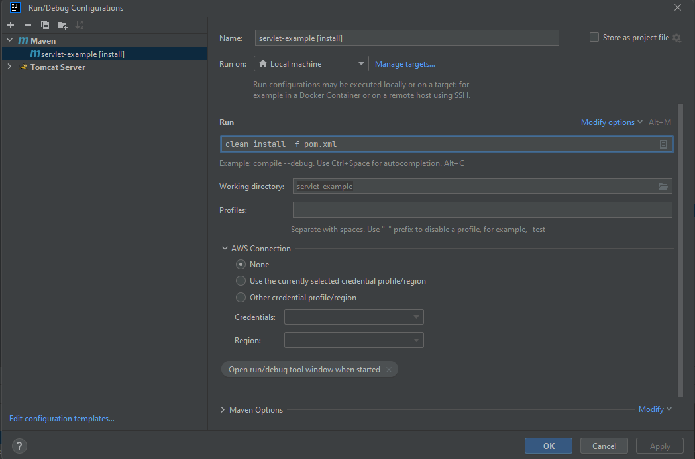
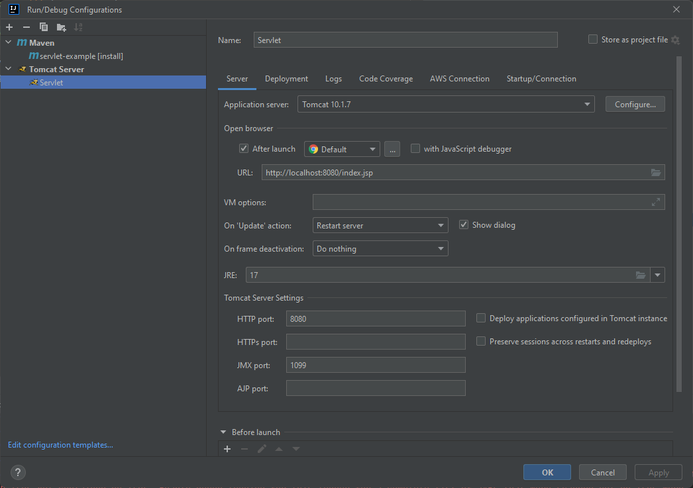
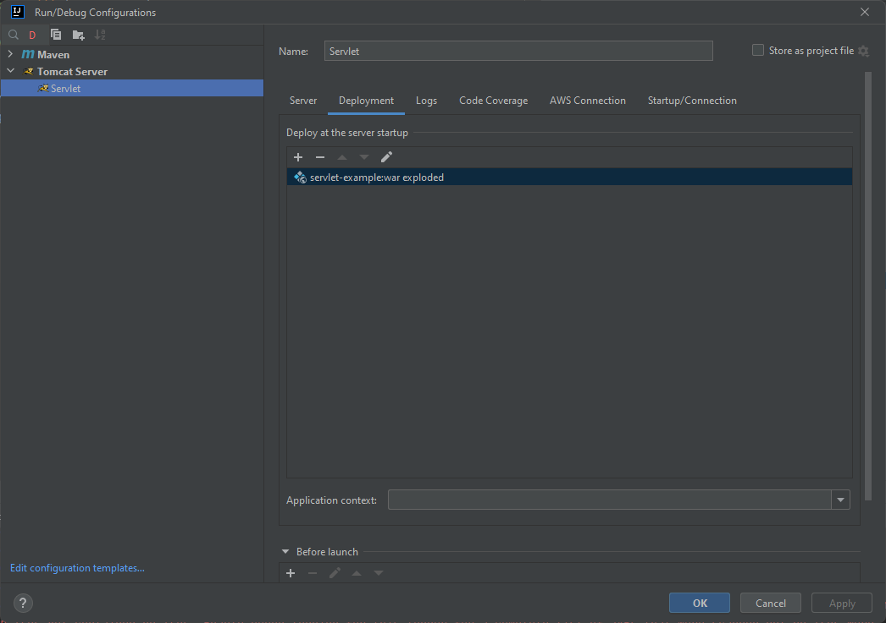

# How to Use (IntelliJ)

1. Run ```mvn clean install -pl :servlet-example``` in your terminal
    - 
2. Setup up a Tomcat instance using ```servlet-example.war exploded``` as the deployment artifact
    - 
    - 
3. Using whatever API client you are comfortable with, make calls to http://localhost:8080 using the paths indicated in
   the code - /data, /jackson, /hello, /ping