# Usage

In this guide I will show you the elements on the screen that you can interact with.  
Every interaction works as it should in the backend. The frontend has hiccups, but
the [Disclosure](https://github.com/210913-java-full-stack/Erika-Kollier/blob/main/README.md#disclosure) says so.

## Eastern Train Co User Guide

`1. Start Application`

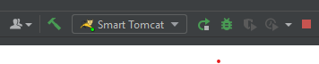

`2. Click The 'Sign Up' Link`

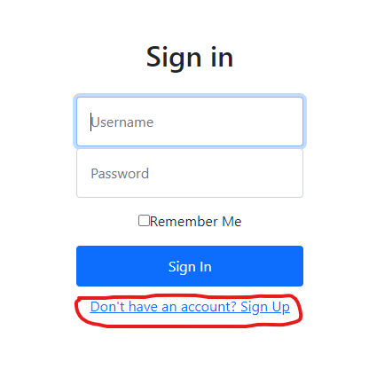

`3. Input Your User Information and Click 'Sign Up'`

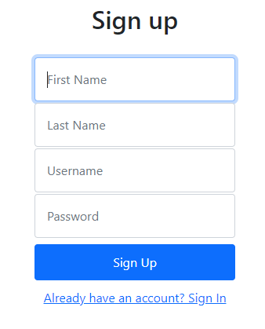

`4. Main Menu`

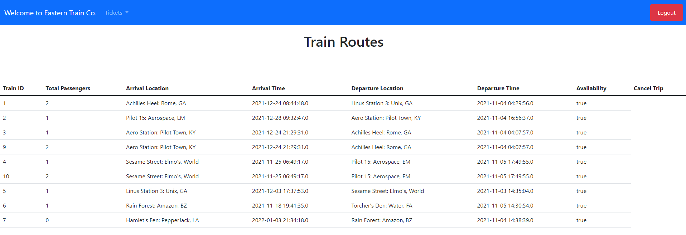

`5. Ticket Modal` 
`You can purchase a ticket or cancel a ticket if you already have one.`

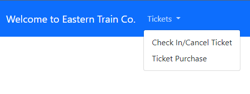

`6. Ticket Purchase Form`

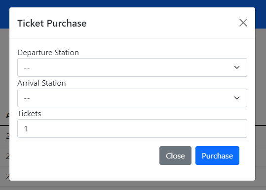

`7. Check-In/Cancel Ticket`

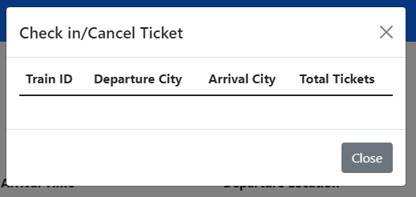

## Eastern Train Co Admin Guide

`1. Start Application`

`2. Input The Super Secret Admin Info From YOUR Database and Login`

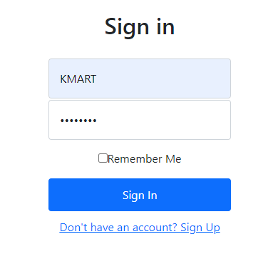

`3. Main Menu. You can cancel a trip directly with the 'Cancel' button`

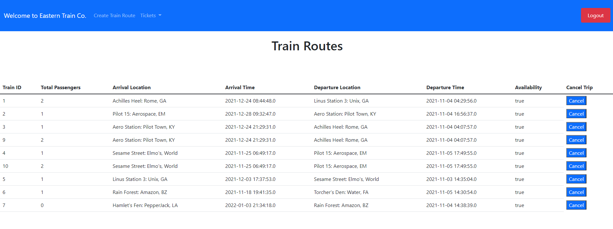

`4. Create Train Route Form`

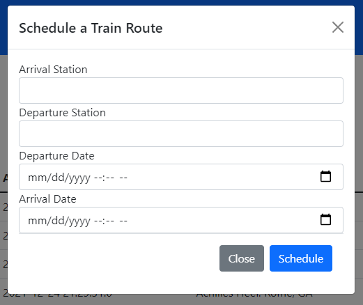

`5. Admin Ticket Modal`

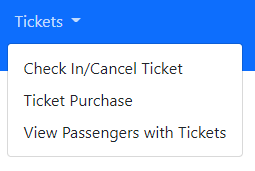

`6. Ticket Purchase Form`

`7. Check-In/Cancel Ticket`

`8. View Passengers with Tickets`

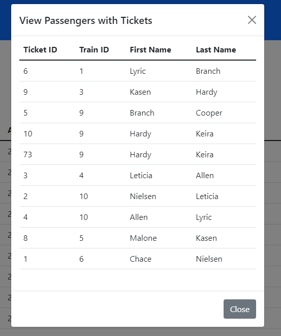
